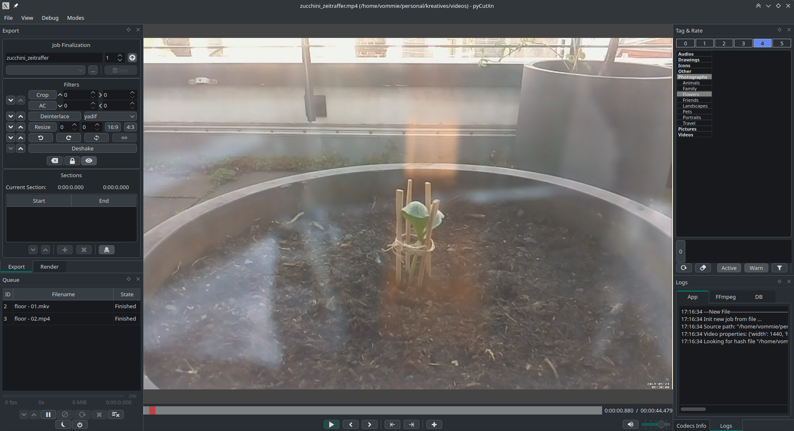

# PyCutXn


**PyCutXn** is a customized, local video cutting and clipping tool designed with a very specific workflow in mind: It allows you to quickly extract clips from video files while simultaneously tagging and rating the resulting clips directly inside the [XnViewMP](https://www.xnview.com/en/xnview-mp/) SQLite database.

It acts as a hybrid between a lightweight video player/cutter (powered by MPV and PyAV/FFmpeg) and an XnViewMP metadata ingest tool.

> ⚠️ **DISCLAIMER:**
> **This project is currently a Work In Progress (WIP).** It is tailored to a specific personal workflow and has only been tested on the author's personal Linux system. Use it entirely at your own risk! **Please backup your `XnView.db` before using it with this software.**



## Features

*   **Integrated Video Player:** Powered by `libmpv` for smooth scrubbing and playback.
*   **Fast Video Cutting/Clipping:** Define multiple sections within a video and export them seamlessly.
*   **Direct XnViewMP Integration:** Tag and rate your newly created video clips directly in the application; the metadata is injected straight into your local `XnView.db`.
*   **Hash Tracking:** Warns you if you are attempting to process a file that has already been edited in the past (tracks file hashes).
*   **Target Folder Verification:** Prevents accidental overwrites by warning you if the target file or base filename already exists.
*   **Extensive Video Filtering (via PyAV):**
    *   **Cropping:** Interactive visual crop overlay to select the exact video frame. Includes an Auto-Crop function.
    *   **Resizing & Aspect Ratio:** Manually scale videos or force 16:9 / 4:3 ratios.
    *   **Deinterlacing:** Selectable deinterlacing methods (yadif, bwdif, etc.).
    *   **Rotation:** Quickly rotate videos by ±90° or 180°.
    *   **Deshaking:** *[WIP]* Video stabilization using `vidstab` filters (currently needs fixing).
*   **Queue Management:** Send multiple jobs to a background queue, pause/resume rendering, rearrange priorities, or cancel jobs mid-render.
*   **Auto-Increment Filenames:** Easily create sequenced clips without manually typing out new filenames.
*   **Power Modes:** Automatically put your PC to sleep or shut it down after the render queue finishes.

## Requirements

*   **Operating System:** Linux strictly required (relies on Linux-specific commands like `systemctl suspend`, `ps`, `kill`, and standard Linux file paths).
*   **Python:** Python 3.8+
*   **System Libraries:** `libmpv` (Make sure `mpv` and its development libraries are installed via your package manager, e.g., `sudo apt install libmpv-dev`).
*   **XnViewMP:** An optional, valid and local `XnView.db` file.

## Installation & Setup

1. **Clone the repository:**
   ```bash
   git clone https://github.com/YOUR_USERNAME/pycutxn.git
   cd pycutxn
   ```

2. **Set up a virtual environment (Recommended):**
   ```bash
   python3 -m venv venv
   source venv/bin/activate
   ```

3. **Install the required Python packages:**
   ```bash
   pip install -r requirements.txt
   ```

4. **Install `python-mpv` manually:**
   Because of how the player interacts with the GUI, you need to place the `mpv.py` wrapper manually into the `libs/` directory.
   * Download `mpv.py` from the official repository: [jaseg/python-mpv](https://raw.githubusercontent.com/jaseg/python-mpv/main/mpv.py)
   * Save the downloaded `mpv.py` file directly into the `pycutxn/libs/` folder.

## Usage

Start the application by running:

```bash
python main.py
```

*   **Drag & Drop:** You can drag and drop a video file directly into the application to load it.
*   **Set Target Database:** Go to `File -> Settings` and point the application to your `XnView.db` file.
*   **Tags & Rating:** Toggle the Tags & Rate pane, select your tags, assign a 1-5 star rating, and hit Save to add the job to the render queue.

## TODOs & Known Issues

- [ ] **UI Panels:** Fix a bug where UI panels / dock widgets sometimes do not restore their positions correctly upon application startup.
- [ ] **Deshaker:** The Deshaker functionality is currently broken due to the recent migration to the PyAV backend. It needs to be fixed to properly pipe the `vidstab` transformation file.

## License

This project is licensed under the [MIT License](LICENSE) - see the LICENSE file for details.
*(Note: Included fonts and the manual `mpv.py` wrapper retain their respective open-source licenses).*
